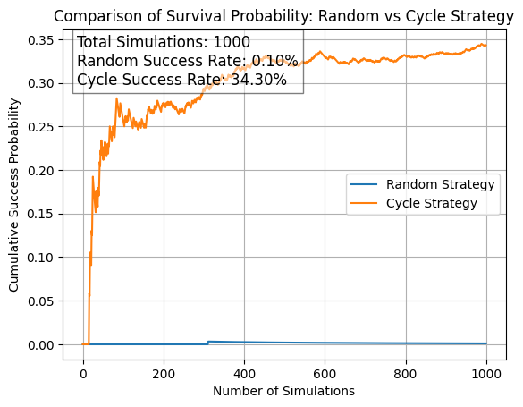

# 10-Prisoners-Strategy-Simulation
10명의 죄수가 특정 상자를 찾아야 하는 문제에서 무작위 선택 전략과 순환 전략의 성공 확률을 비교하는 시뮬레이션 프로젝트입니다. 각 전략의 성공률을 1,000회 반복 실험하여 통계적으로 분석하고, 그래프로 시각화하였습니다.

# 🔄 10명의 죄수: 순환 전략 vs 무작위 전략

## 📌 프로젝트 개요
이 프로젝트는 **10명의 죄수(prisoners dilemma) 문제**를 기반으로 두 가지 전략(무작위 선택 vs 순환 전략)의 성공 확률을 비교하는 시뮬레이션을 수행합니다.

**시뮬레이션 목표:**
- 10명의 죄수가 각각 특정 번호가 적힌 상자를 찾아야 함
- 한 명이라도 실패하면 전체 처형
- 두 가지 전략을 비교하여 생존 확률을 분석

이 프로젝트는 **확률적 사고와 최적 전략을 이해하는 데 도움을 주는 실험적 모델**입니다.

---

## 🕒 개발 히스토리
- 📌 **최초 작성:** 2024년 8월 14일  
- 📌 **업데이트:** 2025년 3월 (GitHub 공유 및 문서화 추가)  
- 📌 **Google Colab에서 실행 후 GitHub에 업로드**
- 📌 **시뮬레이션 과정 시각화를 위해 Matplotlib 사용**

---

## 📂 프로젝트 폴더 구조
```
📄 simulation_result.png   # 1,000번의 시뮬레이션에서 두 전략의 성공 확률을 비교한 결과
📄 10명의죄수_순환.ipynb    # 주요 코드 및 실행 파일 (Google Colab 환경에서 실행 가능)
📄 README.md               # 프로젝트 설명 파일
```

---

## 🔢 문제 개요
10명의 죄수가 있으며, 각 죄수는 1부터 10까지의 번호 중 자신의 번호가 적힌 상자를 찾아야 합니다.

**규칙:**
1. **각 죄수는 최대 5개의 상자만 열 수 있습니다.**
2. **모든 죄수가 자신의 번호를 찾으면 생존, 한 명이라도 실패하면 전원 사망.**
3. **두 가지 전략을 비교:**
   - **무작위 선택(Random Strategy):** 죄수가 무작위로 5개의 상자를 선택하여 확인
   - **순환 전략(Cyclic Strategy):** 죄수가 자기 번호에서 시작해 상자 속 번호를 따라가며 최대 5개 탐색

---

## ⚙️ 코드 설명
### 1️⃣ 랜덤 선택 전략 (Random Strategy)
- 죄수들이 무작위로 5개의 상자를 선택하여 탐색
- **성공 확률이 낮음** (시뮬레이션 결과 약 0.2%)

### 2️⃣ 순환 전략 (Cyclic Strategy)
- 죄수들이 자기 번호에서 시작해 **상자 안의 번호를 따라 이동**
- **성공 확률이 높음** (시뮬레이션 결과 약 30~40%)

### 3️⃣ 시뮬레이션 비교 (Success Rate Analysis)
- 두 전략을 각각 1,000번 실행 후 성공 확률을 계산
- 결과를 Matplotlib 그래프로 시각화하여 비교

---

## 📊 시뮬레이션 결과
아래 그래프는 1,000번의 시뮬레이션에서 두 전략의 성공 확률을 비교한 결과입니다.



- **총 시뮬레이션 횟수:** 1000
- **무작위 전략 성공 확률:** 0.10% (1/1000)
- **순환 전략 성공 확률:** 34.30% (343/1000)

순환 전략이 무작위 전략보다 성공 확률이 **훨씬 높음**을 확인할 수 있습니다.


---

## 🏃 실행 방법
### 📌 Google Colab에서 실행
1. `10명의죄수_순환.ipynb` 파일을 Colab에서 열기
2. 셀을 순차적으로 실행하여 전략별 성공 확률 확인
3. Matplotlib 그래프를 통해 결과 비교

### 📌 로컬 환경에서 실행 (Jupyter Notebook)
```bash
jupyter notebook "10명의죄수_순환.ipynb"
```

---

## 🚀 마무리
이 프로젝트는 **전략적 사고와 확률 이론을 실험적으로 검증**하는 데 활용될 수 있습니다.

📌 향후 개선 사항:
- 죄수 수 증가 (예: 10명 → 100명 확장)
- 상자 개수 및 탐색 제한 변경 실험
- 몬테카를로 시뮬레이션을 통한 대규모 실험

